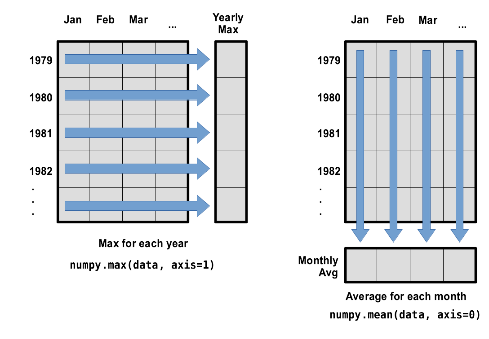

::::::::::::::::::::::::::::::::::::::::::  objectives

- "Explain what a library is and what libraries are used for."
- "Import a Python library and use the functions it contains."
- "Read tabular data from a file into a program."
- "Select individual values and subsections from data."
- "Perform operations on arrays of data."

::::::::::::::::::::::::::::::::::::::::::::::::::

::::::::::::::::::::::::::::::::::::::::::::  questions

- "How can I process tabular data files in Python?"

::::::::::::::::::::::::::::::::::::::::::::::::::


Words are useful, but what's more useful are the sentences and stories we build with them.
Similarly, while a lot of powerful, general tools are built into Python,
specialized tools built up from these basic units live in
[libraries](learners/reference.md#library)
that can be called upon when needed.

## Loading data into Python

To begin processing the wavedata, we need to load it into Python.
We can do that using a library called
[NumPy](https://numpy.org/doc/stable "NumPy Documentation"), which stands for Numerical Python.
In general, you should use this library when you want to do fancy things with lots of numbers,
especially if you have matrices or arrays. To tell Python that we'd like to start using NumPy,
we need to [import](learners/reference.md#import) it:

```python
import numpy
```


Importing a library is like getting a piece of lab equipment out of a storage locker and setting it
up on the bench. Libraries provide additional functionality to the basic Python package, much like
a new piece of equipment adds functionality to a lab space. Just like in the lab, importing too
many libraries can sometimes complicate and slow down your programs - so we only import what we
need for each program.

Once we've imported the library, we can ask the library to read our data file for us:

```python
numpy.loadtxt(fname='wavesmonthly.csv', delimiter=',', skiprows=1)
```


```output
array([[1.979e+03, 1.000e+00, 3.788e+00],
       [1.979e+03, 2.000e+00, 3.768e+00],
       [1.979e+03, 3.000e+00, 4.774e+00],
       ...,
       [2.015e+03, 1.000e+01, 3.046e+00],
       [2.015e+03, 1.100e+01, 4.622e+00],
       [2.015e+03, 1.200e+01, 5.048e+00]], shape=(444, 3))
```


The expression `numpy.loadtxt(...)` is a
[function call](learners/reference.md#function-call)
that asks Python to run the [function](learners/reference.md#function) `loadtxt` which
belongs to the `numpy` library.
The dot notation in Python is used most of all as an object attribute/property specifier or for invoking its method. `object.property` will give you the object.property value, `object_name.method()` will invoke on object_name method.

As an example, John Smith is the John that belongs to the Smith family.
We could use the dot notation to write his name `smith.john`,
just as `loadtxt` is a function that belongs to the `numpy` library.

`numpy.loadtxt` has two [parameters](learners/reference.md#parameter): the name of the file
we want to read and the [delimiter](learners/reference.md#delimiter) that separates values
on a line. These both need to be character strings
(or [strings](learners/reference.md#string) for short), so we put them in quotes. Notice
that we also had to tell NumPy to skip the first row, which contains the column titles.

Since we haven't told it to do anything else with the function's output,
the [notebook](learners/reference.md#notebook) displays it.
In this case,
that output is the data we just loaded.
By default,
only a few rows and columns are shown
(with `...` to omit elements when displaying big arrays).
Note that, to save space when displaying NumPy arrays, Python does not show us trailing zeros,
so `1.0` becomes `1.`.

Our call to `numpy.loadtxt` read our file
but didn't save the data in memory.
To do that,
we need to assign the array to a variable. In a similar manner to how we assign a single
value to a variable, we can also assign an array of values to a variable using the same syntax.
Let's re-run `numpy.loadtxt` and save the returned data:

```python
data = numpy.loadtxt(fname='wavesmonthly.csv', delimiter=',', skiprows=1)
```


This statement doesn't produce any output because we've assigned the output to the variable `data`.
If we want to check that the data have been loaded,
we can print the variable's value:

```python
print(data)
```


```output
[[1.979e+03 1.000e+00 3.788e+00]
 [1.979e+03 2.000e+00 3.768e+00]
 [1.979e+03 3.000e+00 4.774e+00]
 ...
 [2.015e+03 1.000e+01 3.046e+00]
 [2.015e+03 1.100e+01 4.622e+00]
 [2.015e+03 1.200e+01 5.048e+00]]
```


Now that the data are in memory,
we can manipulate them.
First,
let's ask what [type](learners/reference.md#type) of thing `data` refers to:

```python
print(type(data))
```


```output
<class 'numpy.ndarray'>
```


The output tells us that `data` currently refers to an N-dimensional array, the functionality for which is provided by the NumPy library.
These data correspond to sea wave height. Each row is a monthly average, and the columns are their associated dates and values.


::::::::::::::::::::::::::::::::::::::::::  callout

## Data Type
A Numpy array contains one or more elements
of the same type. The `type` function will only tell you that
a variable is a NumPy array but won't tell you the type of
thing inside the array.
We can find out the type
of the data contained in the NumPy array.
```python
print(data.dtype)
```
```output
float64
```
This tells us that the NumPy array's elements are
[floating-point numbers](learners/reference.md#floating-point-number).
::::::::::::::::::::::::::::::::::::::::::::::::::

With the following command, we can see the array's [shape](learners/reference.md#shape):

```python
print(data.shape)
```


```output
(444, 3)
```


The output tells us that the `data` array variable contains 444 rows (sanity check:  37 years of 12 months = 37 * 12 = 444) and 3 columns
 (year, month, and datapoint). When we created the variable `data` to store our wave data, we did not only create the array; we also
created information about the array, called [members](learners/reference.md#member) or
attributes. This extra information describes `data` in the same way an adjective describes a noun.
`data.shape` is an attribute of `data` which describes the dimensions of `data`. We use the same
dotted notation for the attributes of variables that we use for the functions in libraries because
they have the same part-and-whole relationship.

If we want to get a single number from the array, we must provide an
[index](learners/reference.md#index) in square brackets after the variable name, just as we
do in math when referring to an element of a matrix.  Our wave data has two dimensions, so
we will need to use two indices to refer to one specific value:

```python
print('first value in data:', data[0, 2])
```


```output
first value in data: 3.788
```


```python
print('middle value in data:', data[222, 2])
```


```output
middle value in data: 2.446
```


The expression `data[222, 2]` accesses the element at row 222, column 2. While this expression may
not surprise you, using
 `data[0, 2]` to get the _3rd_ column in the _1st_ row might.
Programming languages like Fortran, MATLAB and R start counting at 1
because that's what human beings have done for thousands of years.
Languages in the C family (including C++, Java, Perl, and Python) count from 0
because it represents an offset from the first value in the array (the second
value is offset by one index from the first value). This is closer to the way
that computers represent arrays (if you are interested in the historical
reasons behind counting indices from zero, you can read
[Mike Hoye's blog post](https://exple.tive.org/blarg/2013/10/22/citation-needed/)).
As a result,
if we have an M×N array in Python,
its indices go from 0 to M-1 on the first axis
and 0 to N-1 on the second.
It takes a bit of getting used to,
but one way to remember the rule is that
the index is how many steps we have to take from the start to get the item we want.

{alt="'data' is a 3 by 3 numpy array containing row 0: ['A', 'B', 'C'], row 1: ['D', 'E', 'F'], and
row 2: ['G', 'H', 'I']. Starting in the upper left hand corner, data[0, 0] = 'A', data[0, 1] = 'B',
data[0, 2] = 'C', data[1, 0] = 'D', data[1, 1] = 'E', data[1, 2] = 'F', data[2, 0] = 'G',
data[2, 1] = 'H', and data[2, 2] = 'I',
in the bottom right hand corner."}

::::::::::::::::::::::::::::::::::::::::::  callout

## In the Corner
What may also surprise you is that when Python displays an array,
it shows the element with index `[0, 0]` in the upper left corner
rather than the lower left.
This is consistent with the way mathematicians draw matrices
but different from the Cartesian coordinates.
The indices are (row, column) instead of (column, row) for the same reason,
which can be confusing when plotting data.

::::::::::::::::::::::::::::::::::::::::::::::::::

## Slicing data
An index like `[222, 2]` selects a single element of an array,
but we can select whole sections as well.
For example,
we can select the wavedata for the first year like this:

```python
print(data[0:12, 0:3])
```


```output
[[1.979e+03 1.000e+00 3.788e+00]
 [1.979e+03 2.000e+00 3.768e+00]
 [1.979e+03 3.000e+00 4.774e+00]
 [1.979e+03 4.000e+00 2.818e+00]
 [1.979e+03 5.000e+00 2.734e+00]
 [1.979e+03 6.000e+00 2.086e+00]
 [1.979e+03 7.000e+00 2.066e+00]
 [1.979e+03 8.000e+00 2.236e+00]
 [1.979e+03 9.000e+00 3.322e+00]
 [1.979e+03 1.000e+01 3.512e+00]
 [1.979e+03 1.100e+01 4.348e+00]
 [1.979e+03 1.200e+01 4.628e+00]]
```


The [slice](learners/reference.md#slice) `0:12` means, "Start at index 0 and go up to,
but not including, index 12". Again, the up-to-but-not-including takes a bit of getting used to,
but the rule is that the difference between the upper and lower bounds is the number of values in
the slice.

We don't have to start slices at 0:

```python
print(data[12:24, 1:3])
```


```output
[[ 1.     3.666]
 [ 2.     4.326]
 [ 3.     3.522]
 [ 4.     3.18 ]
 [ 5.     1.954]
 [ 6.     1.72 ]
 [ 7.     1.86 ]
 [ 8.     1.95 ]
 [ 9.     3.11 ]
 [10.     3.78 ]
 [11.     3.474]
 [12.     5.28 ]]
```


We also don't have to include the upper and lower bound on the slice.  If we don't include the lower
bound, Python uses 0 by default; if we don't include the upper, the slice runs to the end of the
axis, and if we don't include either (i.e., if we use ':' on its own), the slice includes
everything:

```python
first_year = data[:12, 2:]
print('data from first year is:')
print(first_year)
```

The above example selects rows 0 through 11 and columns 2 through to the end of the array (which in this case is _only_ the last column).

```output
data from first year is:
[[3.788]
 [3.768]
 [4.774]
 [2.818]
 [2.734]
 [2.086]
 [2.066]
 [2.236]
 [3.322]
 [3.512]
 [4.348]
 [4.628]]
```

:::::::::::::::::::::::::::::::::::::::  challenge

## Slicing Strings

A section of an array is called a [slice](learners/reference.md#slice).
We can take slices of character strings as well:

```python
element = 'oxygen'
print('first three characters:', element[0:3])
print('last three characters:', element[3:6])
```

```output
first three characters: oxy
last three characters: gen
```


What is the value of `element[:4]`?
What about `element[4:]`?
Or `element[:]`?

:::::::::::::::  solution
```output
oxyg
en
oxygen
```

:::::::::::::::::::::::::

What is `element[-1]`?
What is `element[-2]`?

:::::::::::::::  solution
```output
n
e
```

:::::::::::::::::::::::::

Given those answers,
explain what `element[1:-1]` does.

:::::::::::::::  solution
Creates a substring from index 1 up to (not including) the final index,
effectively removing the first and last letters from 'oxygen'
:::::::::::::::::::::::::

How can we rewrite the slice for getting the last three characters of `element`,
so that it works even if we assign a different string to `element`?
Test your solution with the following strings: `carpentry`, `clone`, `hi`.

:::::::::::::::  solution
```python
element = 'oxygen'
print('last three characters:', element[-3:])
element = 'carpentry'
print('last three characters:', element[-3:])
element = 'clone'
print('last three characters:', element[-3:])
element = 'hi'
print('last three characters:', element[-3:])
```

```output
last three characters: gen
last three characters: try
last three characters: one
last three characters: hi
```

:::::::::::::::::::::::::
::::::::::::::::::::::::::::::::::::::::::::::::::

:::::::::::::::::::::::::::::::::::::::  challenge

## Thin Slices

The expression `element[3:3]` produces an
[empty string](learners/reference.md#empty-string),
i.e., a string that contains no characters.
If `data` holds our array of wave data,
what does `data[3:3, 4:4]` produce?
What about `data[3:3, :]`?

:::::::::::::::  solution
```python
array([], shape=(0, 0), dtype=float64)
array([], shape=(0, 3), dtype=float64)
```

:::::::::::::::::::::::::

::::::::::::::::::::::::::::::::::::::::::::::::::


## Analyzing data

NumPy has several useful functions that take an array as input to perform operations on its values.
If we want to find the average wave height for all months on
all years, for example, we can ask NumPy to compute `data`'s mean value:

```python
print(numpy.mean(data))
```


```output
668.9611876876877
```


`mean` is a [function](learners/reference.md#function) that takes
an array as an [argument](learners/reference.md#argument). Given that our
array contains the dates as well as data, with numbers relating to years and months, taking the mean of the
whole array doesn't really make much sense - we don't expect to see 600 metre high waves!

We can use slicing to calculate the correct mean:

```python
print(numpy.mean(data[:,2]))
```


```output
3.383563063063063
```


::::::::::::::::::::::::::::::::::::::::::  callout

## Not All Functions Have Input
Generally, a function uses inputs to produce outputs.
However, some functions produce outputs without
needing any input. For example, checking the current time
doesn't require any input.
```python
import time
print(time.ctime())
```
```output
Sat Mar 26 13:07:33 2016
```
For functions that don't take in any arguments,
we still need parentheses (`()`)
to tell Python to go and do something for us.

::::::::::::::::::::::::::::::::::::::::::::::::::

Let's use three other NumPy functions to get some descriptive values about the wave heights.
We'll also use multiple assignment,
a convenient Python feature that will enable us to do this all in one line.

```python
maxval, minval, stdval = numpy.max(data[:,2]), numpy.min(data[:,2]), numpy.std(data[:,2])

print('Max wave height:', maxval)
print('Min wave height:', minval)
print('Wave height standard deviation:', stdval)
```


Here we've assigned the return value from `numpy.max(data[:,2])` to the variable `maxval`, the value
from `numpy.min(data[:,2])` to `minval`, and so on. Note that we used `maxval`, rather than just `max` - it's
not good practice to use variable names that are the same as [Python keywords](https://docs.python.org/3/reference/lexical_analysis.html#keywords)
or fuction names.

```output
Max wave height: 6.956
Min wave height: 1.496
Wave height standard deviation: 1.1440155050316319
```

::::::::::::::::::::::::::::::::::::::::::  callout

## Getting help on functions

How did we know what functions NumPy has and how to use them?
If you are working in IPython or in a Jupyter Notebook, there is an easy way to find out.
If you type the name of something followed by a dot, then you can use
[tab completion](learners/reference.md#tab-completion)
(e.g. type `numpy.` and then press <kbd>Tab</kbd>)
to see a list of all functions and attributes that you can use. After selecting one, you
can also add a question mark (e.g. `numpy.cumprod?`), and IPython will return an
explanation of the method! This is the same as doing `help(numpy.cumprod)`.
Similarly, if you are using the "plain vanilla" Python interpreter, you can type `numpy.`
and press the <kbd>Tab</kbd> key twice for a listing of what is available. You can then use the
`help()` function to see an explanation of the function you're interested in,
for example: `help(numpy.cumprod)`.

::::::::::::::::::::::::::::::::::::::::::::::::::


::::::::::::::::::::::::::::::::::::::::::  callout

## What about NaNs?
In real datasets, particularly ones which come from observational data, it's quite common
for some values to be missing. There are various strategies to deal with missing values; one of which is to
give them a value that would be clearly wrong (e.g. -1 for a temperature column with units in
Kelvin, or 999 for a missing latitude or longitude value). However, the issue with this is that
we would need to check for these values before calculating any summary statistic.

Instead, we can use NumPy's `nan` ("not a number") value, which will tell NumPy that these are
values that need to be dealt with in a special manner. NumPy also provides various functions to help deal with NaNs.

Beware the NumPy version 1.x used `NaN` and numpy version 2.x uses `nan`, this course assumes you have Numpy version 2.x installed
and will use that convention.

However, we can't use NumPy's normal statistical functions on any array that contains a NaN, as this returns a NaN:

```python
data_nan = numpy.array([[1,2,3],[1,numpy.nan,3],[1,2,3]])
numpy.mean(data_nan)
```
```python
np.float64(nan)
```

Instead, we need to use the NumPy function `nanmean`:
```python
data_nan = numpy.array([[1,2,3],[1,numpy.nan,3],[1,2,3]])
numpy.nanmean(data_nan)
```
```python
np.float64(2.0)
```

If, at a later date, we'd like to replace all the NaNs with a sensible numerical value
(e.g. the mean of the column), NumPy also provides functions that can help with this
::::::::::::::::::::::::::::::::::::::::::::::::::

What happens if the _shape_ of the data is not convenient for us to do some of our analysis? With this
waveheight dataset, the data is a time-series, but it's not very easy to calculate things like
average monthly temperature. To do that, we'll need to _reshape_ it. `Numpy` allows us to do that
relatively easily:

```python
reshaped_data = numpy.reshape(data[:,2], [37,12]) # reshape the data to form a 2D array of year by month
```


We now have a 2D array of data using, where each row is a year, and each column represents a month:

```python
print("The shape of the reshaped data is:")
print(reshaped_data.shape)
```


```output
The shape of the reshaped data is:
(37, 12)
```


We can verify that nothing about the data has changed:

```python
print(f"The maximum value of the reshaped data is: {numpy.max(reshaped_data)}")
print(f"The minimum value of the reshaped data is: {numpy.min(reshaped_data)}")
print(f"The standard deviation of the reshaped data is: {numpy.std(reshaped_data)}")
```


```output
The maximum value of the reshaped data is: 6.956
The minimum value of the reshaped data is: 1.496
The standard deviation of the reshaped data is: 1.1440155050316319
```


We can now look variations in some summary statistics, such as the maximum wave height per month, or average height per year more easily. One way to do this is to create a new temporary array of the data we want, then ask it to do the calculation:

```python
year_0 = reshaped_data[0,:] # 0 on the first axis (rows), everything on the second (columns)
print(f"maximum wave height for year 0: {numpy.max(year_0)}")
```


```output
maximum wave height for year 0: 4.774
```


What if we need the maximum wave height for each month over all years (as in the
next diagram on the left) or the average for each month (as in the
diagram on the right)? As the diagram below shows, we want to perform the
operation across an axis:

{alt="Per-year maximum height is computed row-wise across all columns using
numpy.max(data, axis=1). Per-year average wave height is computed column-wise across all rows using
numpy.mean(data, axis=0)."}

To support this functionality,
most array functions allow us to specify the axis we want to work on.
If we ask for the average across axis 0 (rows in our 2D example),
we get:

```python
print(numpy.mean(reshaped_data, axis=0))
```


```output
[4.59956757 4.39708108 4.09156757 3.26016216 2.60437838 2.3072973
 2.18940541 2.32145946 2.9907027  3.55627027 3.90345946 4.38140541]
```


As a quick check,
we can ask this array what its shape is:

```python
print(numpy.mean(reshaped_data, axis=0).shape)
```


```output
(12,)
```


The expression `(12,)` tells us we have an N×1 vector,
so this is the average wave height per month for all years.
If we average across axis 1 (columns in our 2D example), we get:

```python
print(numpy.mean(reshaped_data, axis=1))
```


```output
[3.34       3.15183333 3.29866667 3.53366667 3.448      3.23016667
 2.99383333 3.51133333 2.96066667 3.20316667 3.62116667 5.1915
 3.28816667 3.529      3.523      3.66866667 3.314      2.99916667
 3.45983333 3.16783333 3.413      3.3435     3.031      3.29366667
 3.138      3.29716667 3.3185     3.24966667 3.4135     3.42866667
 3.168      2.78816667 3.61366667 3.2725     3.32766667 3.2765
 4.385     ]
```


which is the average wave height per month across all years.

## Saving Data

There are occasions though the rest of the lesson when we will want to use the reshaped data. If we close this Notebook, we'll
lose the variables we've created, so let's save the reshaped data to a file:

```python
numpy.savetxt("reshaped_data.csv", reshaped_data, delimiter=',')
```


:::::::::::::::::::::::::::::::::::::::  challenge

## Stacking Arrays

Arrays can be concatenated and stacked on top of one another,
using NumPy's `vstack` and `hstack` functions for vertical and horizontal stacking, respectively.

```python
A = numpy.array([[1,2,3], [4,5,6], [7, 8, 9]])
print('A = ')
print(A)
>
B = numpy.hstack([A, A])
print('B = ')
print(B)
>
C = numpy.vstack([A, A])
print('C = ')
print(C)
```


```output
A =
[[1 2 3]
 [4 5 6]
 [7 8 9]]
B =
[[1 2 3 1 2 3]
 [4 5 6 4 5 6]
 [7 8 9 7 8 9]]
C =
[[1 2 3]
 [4 5 6]
 [7 8 9]
 [1 2 3]
 [4 5 6]
 [7 8 9]]
```


Write some additional code that slices the first and last columns of `A`,
and stacks them into a 3x2 array.
Make sure to `print` the results to verify your solution.

:::::::::::::::  solution

A 'gotcha' with array indexing is that singleton dimensions
are dropped by default. That means `A[:, 0]` is a one dimensional
array, which won't stack as desired. To preserve singleton dimensions,
the index itself can be a slice or array. For example, `A[:, :1]` returns
a two dimensional array with one singleton dimension (i.e. a column
vector).

```python
D = numpy.hstack((A[:, :1], A[:, -1:]))
print('D = ')
print(D)
```


```output
D =
[[1 3]
 [4 6]
 [7 9]]
```

:::::::::::::::::::::::::

:::::::::::::::  solution

An alternative way to achieve the same result is to use Numpy's
delete function to remove the second column of A.

```python
D = numpy.delete(A, 1, 1)
print('D = ')
print(D)
```


```output
D =
[[1 3]
 [4 6]
 [7 9]]
```

:::::::::::::::::::::::::
::::::::::::::::::::::::::::::::::::::::::::::::::

:::::::::::::::::::::::::::::::::::::::  challenge
## Change In Wave Height

In the wave data, one row represents a series of monthly data relating to one year. This means that
the change in height over time is a meaningful concept representing seasonal changes.
Let's find out how to calculate changes in the data contained in an array
with NumPy.

The `numpy.diff()` function takes an array and returns the differences
between two successive values. Let's use it to examine the changes
each day across the first 6 months of waves in year 4 from our dataset.

```python
year4 = reshaped_data[3, :]
print(year4)
```


```output
[3.73  4.886 4.76  3.188 2.528 1.662 1.952 2.388 3.336 4.034 4.502 5.438]
```


Calling `numpy.diff(year4)` would do the following calculations

```output
[ 4.886 - 3.73, 4.76 - 4.886, 3.188 - 4.76, 2.528 - 3.188, 1.662 - 2.528, 1.952 - 1.662, 2.388 - 1.952, 3.336 - 2.388, 4.034 - 3.336, 4.502 - 4.034, 5.438 - 4.502 ]
```


and return the 11 difference values in a new array.

```python
numpy.diff(year4)
```


```output
[ 1.156 -0.126 -1.572 -0.66  -0.866  0.29   0.436  0.948  0.698  0.468
 0.936]
```


Note that the array of differences is shorter by one element (length 11).
Where we see a negative change in wave height, it shows that the sea is becoming calmer as we move towards the summer. Positive wave heights in the autumn show waves are increasing.

If the shape of an individual data file is `(60, 40)` (60 rows and 40
columns), what would the shape of the array be after you run the `diff()`
function and why?

:::::::::::::::  solution

The shape will be `(60, 39)` because there is one fewer difference between
columns than there are columns in the data.
{: .solution}

How would you find the largest change in wave height from month to month within each year?
What does it mean if the change in height is an increase or a decrease?

:::::::::::::::::::::::::

:::::::::::::::  solution

By using the `numpy.max()` function after you apply the `numpy.diff()`
function, you will get the largest difference between months.

```python
numpy.max(numpy.diff(reshaped_data, axis=1), axis=1)
```


```output
array([1.086, 1.806, 1.776, 1.156, 1.692, 1.274, 0.798, 2.59 , 1.338,
      1.634, 0.992, 0.618, 1.054, 1.652, 1.472, 1.716, 0.766, 1.496,
      1.656, 1.04 , 1.228, 1.336, 1.564, 1.066, 1.242, 1.604, 0.802,
      1.04 , 0.652, 0.86 , 1.176, 0.97 , 1.68 , 1.556, 1.904, 2.936,
      1.578])
```


If wave height values *decrease* along an axis, then the difference from
one element to the next will be negative. If
you are interested in the **magnitude** of the change and not the
direction, the `numpy.absolute()` function will provide that.

Notice the difference if you get the largest _absolute_ difference
between readings.

```python
numpy.max(numpy.absolute(numpy.diff(reshaped_data, axis=1)), axis=1)
```


```output
array([1.956, 1.806, 1.776, 1.572, 3.6  , 2.418, 0.954, 2.798, 1.338,
       1.634, 2.13 , 0.93 , 1.054, 1.71 , 1.68 , 2.   , 1.614, 1.496,
       2.308, 1.04 , 2.014, 1.68 , 1.564, 1.596, 1.528, 1.604, 1.468,
       1.21 , 1.012, 0.86 , 1.732, 1.03 , 1.68 , 1.774, 1.904, 2.936,
       1.694])
```


:::::::::::::::::::::::::
::::::::::::::::::::::::::::::::::::::::::::::::::


::::::::::::::::::::::::::::::::::::::::::  keypoints

- "Import a library into a program using `import libraryname`."
- "Use the `numpy` library to work with arrays in Python."
- "The expression `array.shape` gives the shape of an array."
- "Use `array[x, y]` to select a single element from a 2D array."
- "Array indices start at 0, not 1."
- "Use `low:high` to specify a `slice` that includes the indices from `low` to `high-1`."
- "Use `# some kind of explanation` to add comments to programs."
- "Use `numpy.mean(array)`, `numpy.max(array)`, and `numpy.min(array)` to calculate simple statistics."
- "Use `numpy.mean(array, axis=0)` or `numpy.mean(array, axis=1)` to calculate statistics across the specified axis."

::::::::::::::::::::::::::::::::::::::::::::::::::
